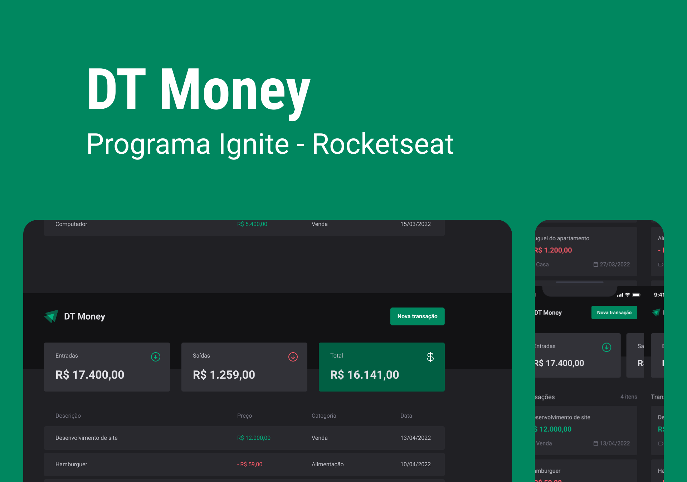

<div align="center">
  <h1> DT Money </h1>
</div> 

<div align="center">
  <a href="#-Technologies"><b>Technologies</b></a>&nbsp;&nbsp;&nbsp;|&nbsp;&nbsp;&nbsp;
  <a href="#-Project"><b>Project</b></a>&nbsp;&nbsp;&nbsp;|&nbsp;&nbsp;&nbsp;
  <a href="#-Layout"><b>Layout</b></a>&nbsp;&nbsp;&nbsp;
</div>

<br></br>

<div align="center">
  
</div> 

<br></br>

## 🚀 Getting started

Clone the project and access the folder.

```bash
$ git clone https://github.com/diaspd/dt-money.git
$ cd 
```

## Installation

```bash
$ npm install
```

## Running the app

```bash
$ npm run dev
```

## Running the Json Server

```bash
$ npm run dev:server
```

The app will be available on `http://localhost:5173/`
The server will be available on `http://localhost:3000/`

<br></br>

## 💻 Technologies

This project was developed with the following technologies:
<b>
- Reactjs
- Type Script
- Java Script
- Json Server
- Vitejs
</b>

</br>

## 📄 Project
💰Project to manage finances.

<br></br>

## 🔖 Layout
- [DT-Money - Figma](https://www.figma.com/community/file/1138814493269096792/DT-Money)

<br></br>

Made with ♥ by Pedro Dias. 👋 Follow me on social media!

<br></br>

If you can give a little star, I appreciate it 🤩
